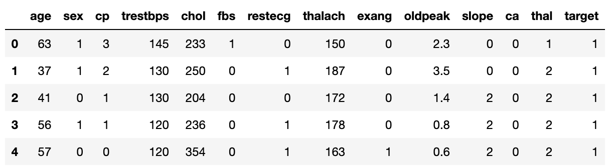
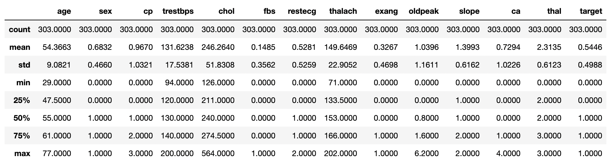
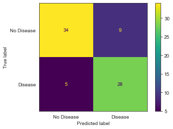
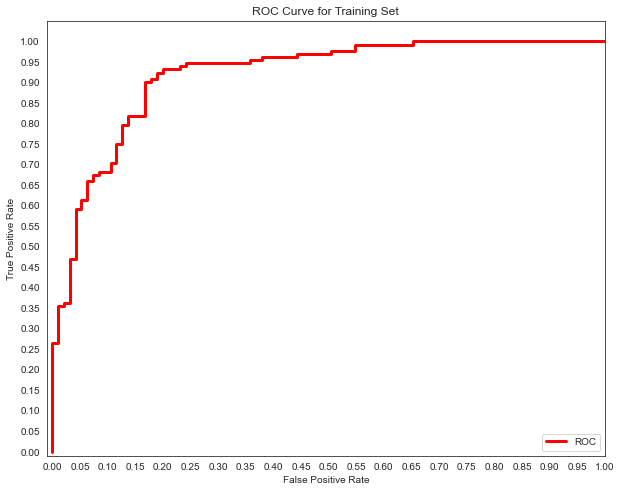
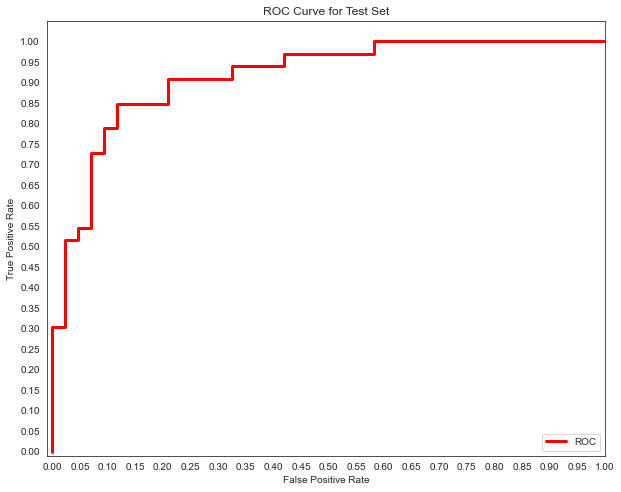

# Making Predictions with Logistic Regression ([Scikit-Learn](https://scikit-learn.org/stable/))


In this tutorial, I will be sharing how to make predictions using logistic regression. The purpose of using logistic regression really begins with a question, that being a yes/no, true/false, or other binary question. In better terms, logistic regression is used for a binary classification problem and is considered to be a supervised machine learning/statistical model. 

An example of a scenario where logistic regression would be helpful could be when predicting if a patient has a disease or not, if an email is spam or not spam, or if a transaction is fraudulent or not fraudulent. 

To reiterate, logistic regression should not be used as a model to predict anything, but rather is a model used when a prediction is not continuous. For the sake of this tutorial, we will look at a binary classification problem, but logistic regression can be used to predict multiple classes of predictors. 

## Step 1
### Find the data and state the target

We will be using a dataset called *[Heart Disease UCI](https://www.kaggle.com/ronitf/heart-disease-uci)* from Kaggle. Specifically looking at the data from year 2019.

**Creator Credit:**
- Hungarian Institute of Cardiology. Budapest: Andras Janosi, M.D.
- University Hospital, Zurich, Switzerland: William Steinbrunn, M.D.
- University Hospital, Basel, Switzerland: Matthias Pfisterer, M.D.
- V.A. Medical Center, Long Beach and Cleveland Clinic Foundation: Robert Detrano, M.D., Ph.D.

The dataset had 13 predictor columns with information like age, sex, chest pain, cholesterol, and other heart-related metrics. The target column is binary (0,1) with 0 meaning no heart disease present and 1 meaning heart disease present. Our goal is to predict if someone has heart disease or not. To begin, let’s take a look at the dataset. 

## Step 2
### Do some exploratory data analysis

Import Pandas
```
import pandas as pd
```

Load the data
```
df = pd.read_csv('heart.csv')
```

View the data
```
df.head()
```


Check the datatypes of each column and check for null values
```
df.info()

Output:
<class 'pandas.core.frame.DataFrame'>
RangeIndex: 303 entries, 0 to 302
Data columns (total 14 columns):
 #   Column    Non-Null Count  Dtype  
---  ------    --------------  -----  
 0   age       303 non-null    int64  
 1   sex       303 non-null    int64  
 2   cp        303 non-null    int64  
 3   trestbps  303 non-null    int64  
 4   chol      303 non-null    int64  
 5   fbs       303 non-null    int64  
 6   restecg   303 non-null    int64  
 7   thalach   303 non-null    int64  
 8   exang     303 non-null    int64  
 9   oldpeak   303 non-null    float64
 10  slope     303 non-null    int64  
 11  ca        303 non-null    int64  
 12  thal      303 non-null    int64  
 13  target    303 non-null    int64  
dtypes: float64(1), int64(13)
memory usage: 33.3 KB
```

Fortunately, there are no null values present and the categorical variables like *sex* have already been encoded

Check the decsriptive statistics 
```
round(df.describe(), 4)
```


With my lack of domain knowledge, I cannot tell too much here. However, I can see that there are binary values for the target, age ranges from 29 to 77, and there are more 1's than 0's in the target.

Taking a closer look at the target class balance
```
df['target'].value_counts()

Output: 
1    165
0    138
Name: target, dtype: int64
```

It seems that the target class is quite balanced here, so not too much to worry about.

**Takeaways**: The dataset is very clean, but it has very few entries which is concerning especially when we split the data in the next step. Although the initial EDA seems a bit tedious, it is very important to do every time before modeling. 

## Step 3
### Train-Test Split

Here I will seperate the target from the predictor variables (y, X) and split those into training and testing sets. The default from Scikit-Learn is 25% on the testing data and 75% on the training data. I also created a random state for the purpose of the tutorial having the same results each time, feel free alter that state. As prior stated, we need to note of imbalance in the dataset since the amount of entries is quite small. Scikit will automatically balance the target variables, but imaging if something like age became unbalanced where older ages went into the test but not the train. Something to consider.


Code:
```
X = df.drop(['target'], axis=1)
y = df['target']

X_train, X_test, y_train, y_test = train_test_split(X, y, random_state=43214)
```
## Step 4
### Set up the pipeline

I know ahead of time that I will be needing the scale my data, so I will begin with instantiating Scikit-Learn StandardScaler. The reason for this is because we want each predictor variable to be relative to one another. Therefore, the StandardScaler will "standardize features by removing the mean and scaling to unit variance" for each predictor using the z-score formula: **z = (x - u) / s**

*Important note*: the scaler should only be fit to the training set **not** the testing set in order to avoid data leakage.

After I intantiate the StandardScaler, I will instantiate Scikit-Learn LogisticRegression. I pass in the parameters fit_intercept=False, C=1e16, solver='liblinear'. The fit_intercept is set to True by default, and we do not need to add a constant in this case. The C value is the inverse regularization, which as of now is quite an arbitrary guess but can be adjusted later. The lower the number, the stronger the regularization. For the solver, I chose 'liblinear' because Scikit-Learn recommends for small datasets.

Finally, added the StandardScaler and LogisticRegression objects into a pipeline which helps for minimal code and making adjustments.

Code:
```
# Instantiate Standard Scaler and Logistic Regression
scaler = StandardScaler()
logreg = LogisticRegression(fit_intercept=False, C=1e16, solver='liblinear')

# Creating a classifier pipeline 
clf = Pipeline([('ss', scaler), 
                ('log', logreg)])
```

## Step 5
### Fit the model
Here we want to simply fit the model to our **training data**, then we will be ready to examine performance metrics.

Code:
```
clf.fit(X_train, y_train)
```

## Step 6
### Examine accuracy and log loss scores

The first metrics I will look at are the accuracy and log loss scores. 

The accuracy score will tell us the rate that the model correctly predicted the positive and negative results (true positives + true negatives / total).

The log loss scores will show the error for each model. Similary to MSE or RMSE in a linear a linear model, but in this case it is a bit harder to interpret, but in general a lower log-loss value means better predictions. Its main use here is to compare the train and the test performance. 

Code:
```
# Get the train and test accuracy scores
print(f"Train Score: {clf.score(X_train, y_train)}")
print(f"Test Score: {clf.score(X_test, y_test)}")

Output:
Train Score: 0.8722466960352423
Test Score: 0.8157894736842105
```

Code:
```
# Get the train and test logloss results
print(f"Train LogLoss: {log_loss(y_train, clf.predict_proba(X_train))}")
print(f"Test LogLoss: {log_loss(y_test, clf.predict_proba(X_test))}")

Output:
Train LogLoss: 0.35896912360998906
Test LogLoss: 0.36611952610146714
```
What do these mettrics mean?

## Step 7
### Confusion Matrix

Here we will visualize a confusion matrix of our testing results. The confusion matrix will show the the true positive, true negative, false postive, and false negative results.

Code:
```
plot_confusion_matrix(clf, X=X_test, y_true=y_test, display_labels=['No Disease', 'Disease'])
plt.grid(False);
```


We can easily cross check our accuracy measure here: (true neg + true pos) / total = 62/76 = 81%

Moreover, we can see where the model failed. In this case there are both false positives and false negatives (which we don't want). In this case we can assume that false negatives are the least desirable. This is given the cost of each. If someone is told they are negative, but actually are positive, this risks their life. on the other hand, if someone is told they are positive when they are negative, a further test could shed light on the truth.

This situation brings us to our next set of metrics: recall, precision, and F1-score.


## Step 8
### Precision, Recall, & F1-score

Scikit-Learn has a very handy function for getting all of these scores, it is called the `classification_report`. 

Precision will tell how well the model identified the true data points (true postives / (true positives + false positives). A higher score is better!

Recall will tell often the model fails to predict the true positives (true postives / (true positives + false negatives). A higher score is better!

F1-Score will tell us the the "Harmonic Mean of Precision and Recall", which informs if both recall and precisino are high. A higher score is better!

*Let's see our results*

Code:
```
# creating an object of predictors from the test data
y_hat = clf.predict(X_test)

# Print metrics: recall, precision and f1
print(classification_report(y_test, y_hat, output_dict=False))

Output:

              precision    recall  f1-score   support

           0       0.87      0.79      0.83        43
           1       0.76      0.85      0.80        33

    accuracy                           0.82        76
   macro avg       0.81      0.82      0.81        76
weighted avg       0.82      0.82      0.82        76
```

Well, precision,r ecall and f1-score are relatively high, but in the context of the medical industry, I am sure this would not be sufficient enough for a diagnosis.

## Step 9
### ROC curve and AUC

The last metrics we will analyze are the ROC and AUC.

The Receiver Operator Characteristic (ROC) curve "illustrates the true positive rate against the false positive rate of our classifier" (Flatiron).

The Area Under the Curve (AUC) gives us a metric to compare ROC curves. It tells us literally how much area is under the curve. The lowerst score being .5 and the highest being 1. 

Let's see how our model performs on the train and the test set.

Code:
```
# Calculate the probability scores of each point in the training set
y_train_score = clf.predict_proba(X_train)[:,1]

# Calculate the fpr, tpr, and thresholds for the training set
train_fpr, train_tpr, thresholds = roc_curve(np.array(y_train), np.array(y_train_score))

# Calculate the probability scores of each point in the test set
y_score = clf.predict_proba(X_test)[:,1]

# Calculate the fpr, tpr, and thresholds for the test set
test_fpr, test_tpr, thresholds = roc_curve(y_test, y_score)
```
```
# Seaborn Style
sns.set_style('white')

# Train ROC Curve
plt.figure(figsize=(10, 8))
plt.plot(train_fpr, train_tpr, color='red',
         lw=3, label='ROC')

plt.xlim([-0.01, 1.0])
plt.ylim([-0.01, 1.05])
plt.yticks([i/20.0 for i in range(21)])
plt.xticks([i/20.0 for i in range(21)])
plt.xlabel('False Positive Rate')
plt.ylabel('True Positive Rate')
plt.title('ROC Curve for Training Set')
plt.legend(loc='lower right')
print('AUC: {}'.format(auc(train_fpr, train_tpr)))
plt.show()

Output: 
AUC: 0.9187400318979266
```

```
# Seaborn Style
sns.set_style('white')

# Test ROC Curve
plt.figure(figsize=(10, 8))

plt.plot(test_fpr, test_tpr, color='red',
         lw=3, label='ROC')

plt.xlim([-0.01, 1.0])
plt.ylim([-0.01, 1.05])
plt.yticks([i/20.0 for i in range(21)])
plt.xticks([i/20.0 for i in range(21)])
plt.xlabel('False Positive Rate')
plt.ylabel('True Positive Rate')
plt.title('ROC Curve for Test Set')
plt.legend(loc='lower right')
print('AUC: {}'.format(auc(test_fpr, test_tpr)))
plt.show()

Output: 
AUC: 0.9154334038054969
```


## Step 10
### Make the model better


#### Credits & Thanks: Flatiron School, Python, Scikit-Learn, Pandas, Numpy, Matplotlib, Seaborn, Kaggle, Stackoverflow, & Wikipedia.
